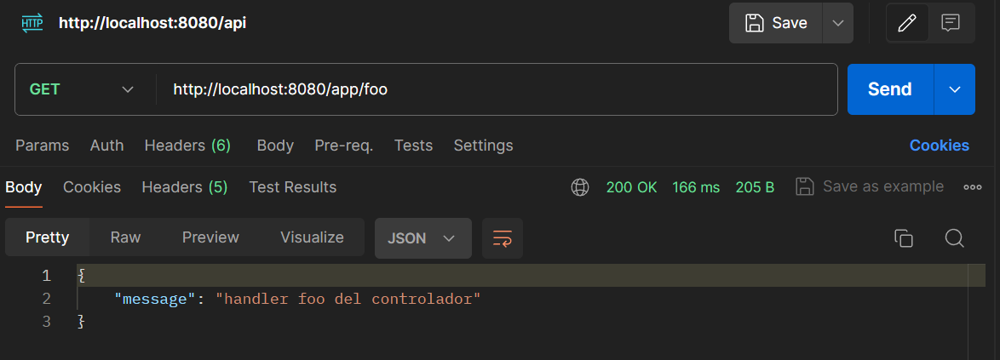

# Interceptores-Spring
## Descripción del proyecto

Este proyecto es un incio al uso de interceptores para aplicar funcionalidades para ciertas peticiones
http.

## Características

- **Spring MVC**: Para la gestión de solicitudes y la lógica del controlador.
- **Inyeccion de Dependencias**: Permite a una clase, obtener desde el contenedor, una referencia de otro objeto.
- **Maven**: Para la gestión de dependencias.
- **Spring Boot**: Para facilitar la configuración y el despliegue de la aplicación.
- **Postman**: Facilita las peticiones HTTP, para crear APIs.


## Implementacion

Agregamos un configuracion en el package principal para registar el interceptor `MvcConfig`.

```java
@Configuration
public class MvcConfig implements WebMvcConfigurer {

    @Autowired
    @Qualifier("timeInterceptor")
    private HandlerInterceptor timeInterceptor;

    @Override
    public void addInterceptors(InterceptorRegistry registry) {
        registry.addInterceptor(timeInterceptor).addPathPatterns("/app/bar", "/app/foo");
        // registry.addInterceptor(timeInterceptor).addPathPatterns("/app/**");
        // registry.addInterceptor(timeInterceptor).excludePathPatterns("/app/bar");
    }
}
```

Usamos el interceptor `LoadingTimeInterceptor` implementado con la interface `HandlerInterceptor` para 
agregar la funcionalidad al controlador `FooController` de mostrar un mensaje en formato `JSON`.

```java
@Component("timeInterceptor")
public class LoadingTimeInterceptor implements HandlerInterceptor{

    private static final Logger logger = LoggerFactory.getLogger(LoadingTimeInterceptor.class);

    @Override
    public boolean preHandle(HttpServletRequest request, HttpServletResponse response, Object handler)
    throws Exception {
        HandlerMethod controller = ((HandlerMethod) handler);
        logger.info("LoadingTimeInterceptor: preHandle() entrando .... " + controller.getMethod().getName());

        long start = System.currentTimeMillis();
        request.setAttribute("start", start);

        Random random = new Random();
        int delay = random.nextInt(500);
        Thread.sleep(delay);

        // Map<String, String> json = new HashMap<>();
        // json.put("error", "no tienes acceso a esta pagina!");
        // json.put("date", new Date().toString());

        // ObjectMapper mapper = new ObjectMapper();
        // String jsonString = mapper.writeValueAsString(json);
        // response.setContentType("application/json");
        // response.setStatus(401);
        // response.getWriter().write(jsonString);
        // return false;
        return true;
    }
    
    @Override
    public void postHandle(HttpServletRequest request, HttpServletResponse response, Object handler,
            @Nullable ModelAndView modelAndView) throws Exception {

        long end = System.currentTimeMillis();
        long start = (long) request.getAttribute("start");
        long result = end - start;
        logger.info("Tiempo trascurrido: " + result + " milisegundos!");
        logger.info(
                "LoadingTimeInterceptor: postHandle() saliendo ...." + ((HandlerMethod) handler).getMethod().getName());
        logger.info(response.getOutputStream().toString());
    }
}
```


```java
@RestController
@RequestMapping("/app")
public class FooController {
    
    @GetMapping("/foo")
    public Map<String, String> foo() {
        
        return Collections.singletonMap("message", "handler foo del controlador");
    }

    @GetMapping("/bar")
    public Map<String, String> bar() {
        
        return Collections.singletonMap("message", "handler bar del controlador");
    }    
    
    @GetMapping("/baz")
    public Map<String, String> baz() {
        
        return Collections.singletonMap("message", "handler baz del controlador");
    }
}
```

## Uso de Postman

**GET**
```sh
http://localhost:8080/invoices/app/foo
http://localhost:8080/invoices/app/bar
http://localhost:8080/invoices/app/baz
```




